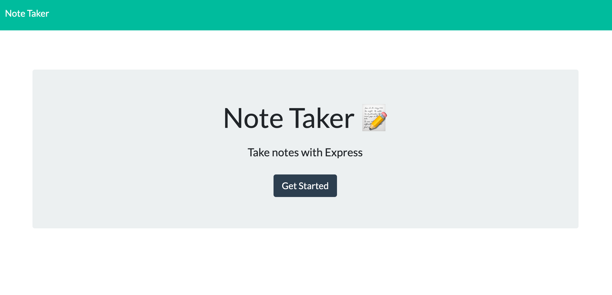

# Note Taker App
This application allows you to create, post and delete notes. 

Here is a deployed link: https://note-taker-ega.herokuapp.com/

 
 ## Table of Contents 
 * [Instructions](#Installation-Instructions)  
 * [Demonstration](#Demonstration)
  * [Questions](#Questions) 
 
 
 
 ## Instructions for Use 
* Open Link and click Get Started 
* Create a title and write note contents
* Click the save icon in the top right corner 
* To Delete, click trash can icon

# Demonstration
https://youtu.be/dtjWIzDsdAI

# Technologies Used
* HTML 
* CSS 
* JavaScript 
* JQuery
* node.js
* Express
* Hosted on Heroku 

 ## Questions  
 * Github Username: emgal-aguirre 
 * Email: emgal.aguirre@gmail.com 
 
